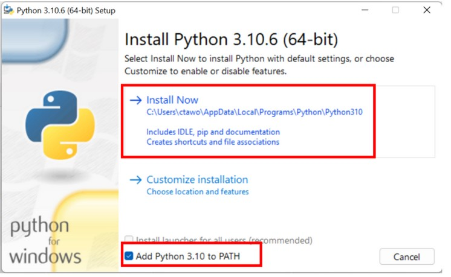
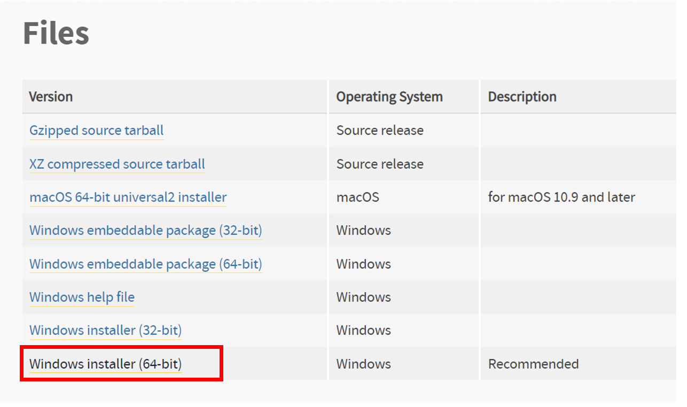
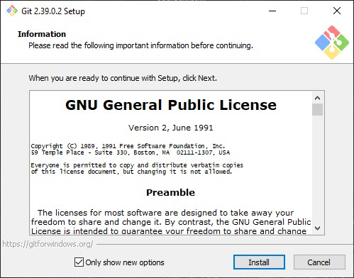
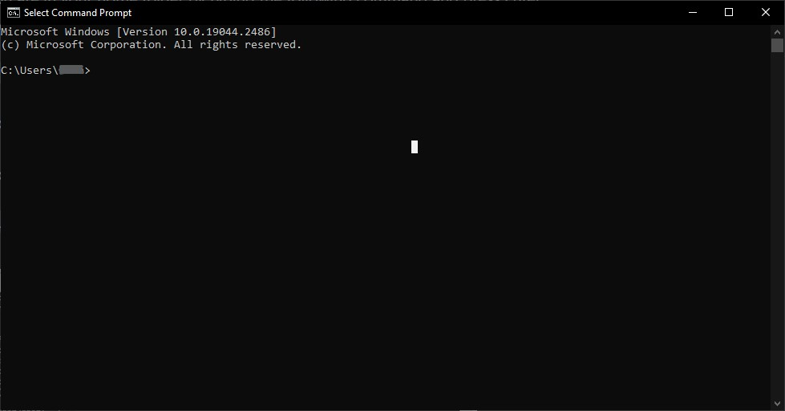
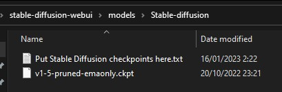
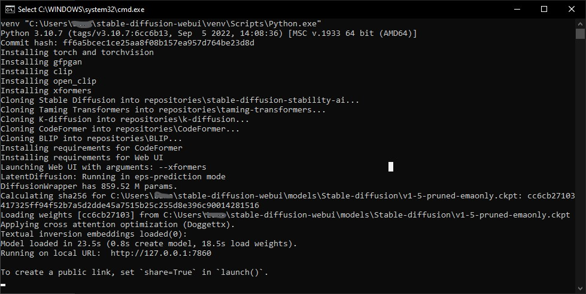
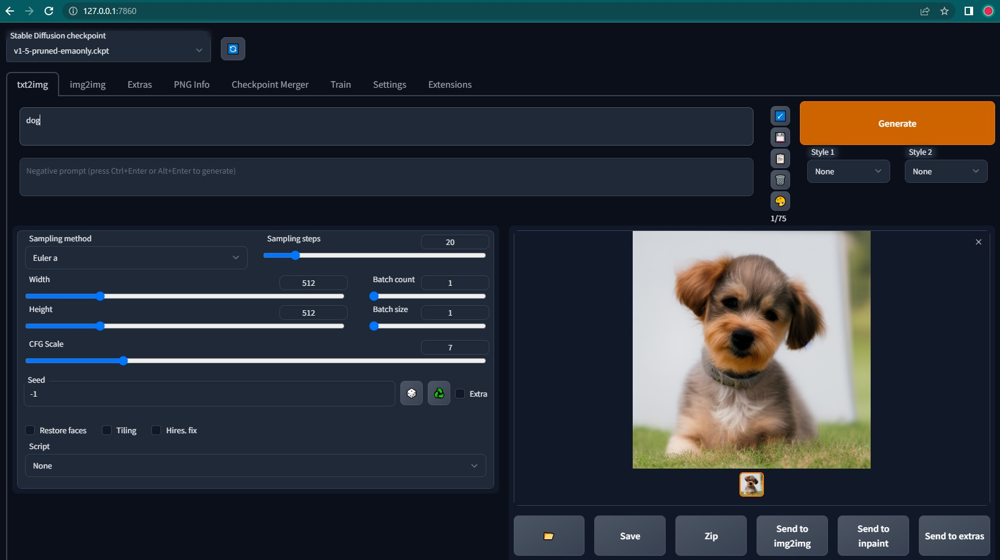

# התקנת AUTOMATIC1111 ממשק לStable Diffusion

## דרישות מערכת

ווינדוס 10

כרטיס מסך 4GB מינימום, עדיף +6GB


## שלב 1. התקנת פייתון 

נצטרך Python 3.10.6 כדי להפעיל את Stable Diffusion.

[הורידו פייתון](https://www.python.org/ftp/python/3.10.6/python-3.10.6-amd64.exe)

אחרי ההורדה פתחו את קובץ ההתקנה




ודאו ש "Add Python 3.10 to PATH" מסומן. לחצו על "Install Now" כדי להתחיל בהתקנה.


## שלב 2. התקנת גיט

גיט היא מערכת לניהול גרסאות, נזדקק לה כדי להתקין ולעדכן את AUTOMATIC1111.


[כנסו לדף זה כדי להוריד את גרסת ווינדוס.](https://git-scm.com/download/win)




אחרי ההורדה פתחו את קובץ ההתקנה לחצו על "Install" כדי להתקין את התוכנה.




עקבו אחרי ההוראות להשלמת ההתקנה. 


 ## שלב 3: התקנת ממשק דפדפן של AUTOMATIC1111

פתחו חיפוש בווינדוס והקלידו CMD

אתם אמורים לראות בשורת הפקודה מציגה משהו כמו
C:\Users\YOUR_USER_NAME>




לאחר מכן הקלידו את הפקודה הבאה והקשו Enter כדי לשכפל את מאגר AUTOMATIC1111.

הקלידו:

```
git clone https://github.com/AUTOMATIC1111/stable-diffusion-webui.git
```
הקלידו:

```
cd stable-diffusion-webui
```
הקלידו:

```
start .
```
הורידו את המודל [Stable Diffusion v1.5](https://huggingface.co/runwayml/stable-diffusion-v1-5) [קישור ישיר להורדת המודל](https://huggingface.co/runwayml/stable-diffusion-v1-5/resolve/main/v1-5-pruned-emaonly.ckpt). שימו את המודל בתיקייה \stable-diffusion-webui\models\Stable-diffusion.




חיזרו אחורה ל stable-diffusion-webui


דאבל קליק על webui-user.bat כדי להפעיל ולהשלים את ההתקנה.

השלב האחרון ייקח זמן מה. כשזה יסתיים, תראו הודעה

Running on local URL: http://127.0.0.1:7860




העתיקו את הכתובת לדפדפן

```
http://127.0.0.1:7860
```


הותקן בהצלחה
